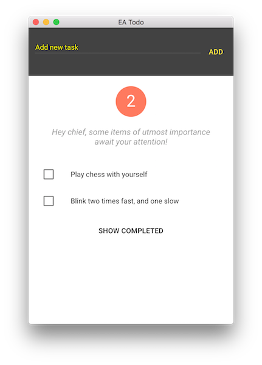

# Test Todo Application. fork by EATODO

Application for introduction series on integrating AngularJS with Electron. Introduction series can be found [here](http://electron.rocks/electron-angularjs/).

$ git clone [- - ]
$ cd electron-test-app
$ npm install
$ npm start
